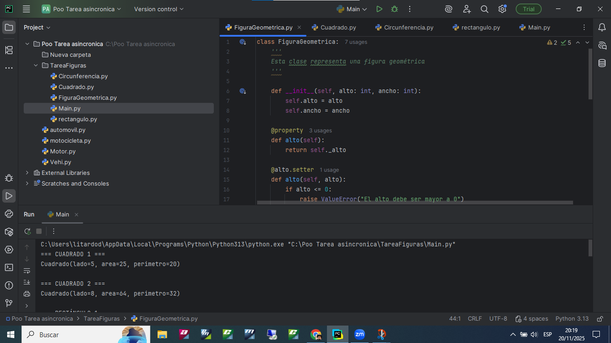
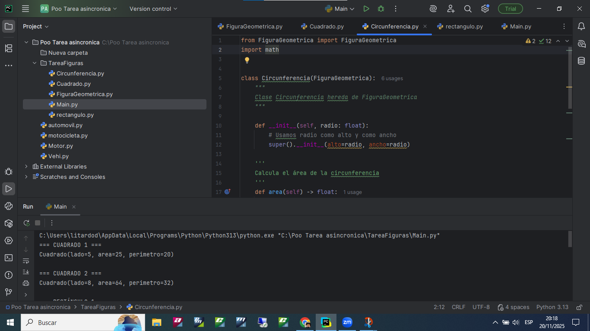
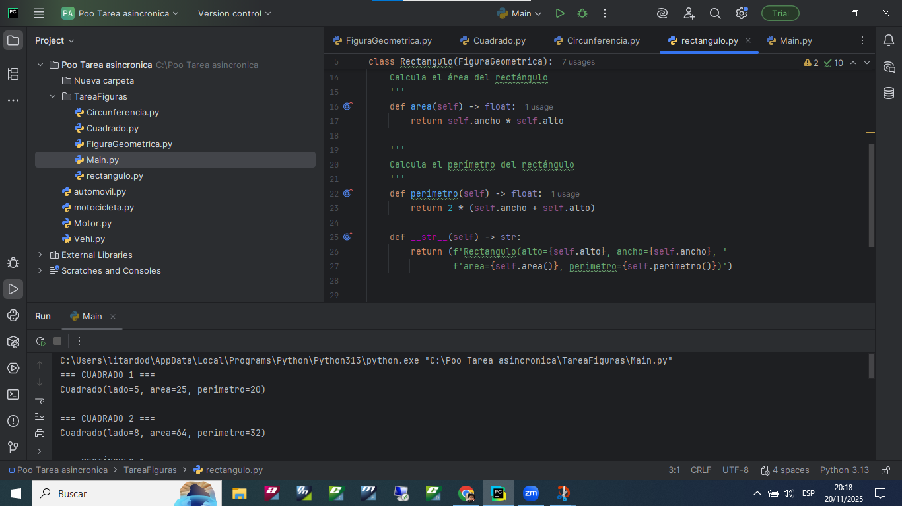
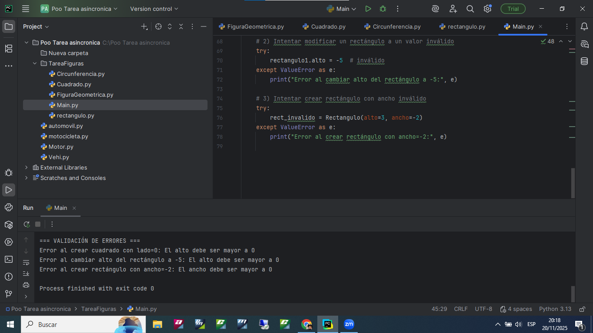

# TallerFigurasPOO
# Tarea: Figuras Geométricas en Python

## 1. Descripción del ejercicio

Se implementa un programa en Python usando Programación Orientada a Objetos (POO) para trabajar con figuras geométricas.  
Hay una **clase base** y varias **clases hijas** que calculan área y perímetro y validan que los valores sean correctos.

---

## 2. Clases del proyecto

### 2.1. FiguraGeometrica (`figura_geometrica.py`)

- Clase base.
- Atributos privados: `_alto` y `_ancho`.
- Uso de `@property` y `@setter` para `alto` y `ancho`.
- Validación: si `alto` o `ancho` ≤ 0 se lanza `ValueError`.
- Métodos:
  - `area()` → `ancho * alto`
  - `perimetro()` → no implementado (`pass`)
  - `__str__()` → muestra alto, ancho y área.

### 2.2. Cuadrado (`cuadrado.py`)

- Hereda de `FiguraGeometrica`.
- Recibe un solo parámetro: `lado`.
- Usa `lado` como alto y ancho.
- Sobrescribe:
  - `area()` → `lado * lado`
  - `perimetro()` → `4 * lado`
  - `__str__()` → muestra lado, área y perímetro.

### 2.3. Rectangulo (`rectangulo.py`)

- Hereda de `FiguraGeometrica`.
- Recibe `alto` y `ancho`.
- Sobrescribe:
  - `area()` → `ancho * alto`
  - `perimetro()` → `2 * (ancho + alto)`
  - `__str__()` → muestra alto, ancho, área y perímetro.

### 2.4. Circunferencia (`circunferencia.py`)

- Hereda de `FiguraGeometrica`.
- Recibe `radio`.
- Usa `math.pi` para los cálculos.
- Sobrescribe:
  - `area()` → `π * radio²`
  - `perimetro()` → `2 * π * radio`
  - `__str__()` → muestra radio, área y perímetro.

---

## 3. Programa principal (`main.py`)

- Crea:
  - dos cuadrados,
  - dos rectángulos,
  - dos circunferencias.
- Muestra:
  - área y perímetro de cada objeto (con `print(objeto)`).
- Prueba **validación de errores** usando `try/except`:
  - se crean o modifican figuras con valores inválidos (`0` o negativos),
  - se captura el `ValueError` y se imprime el mensaje en pantalla.
 
  





Ejemplo de validación en `main.py`:

```python
try:
    cuadrado_invalido = Cuadrado(lado=0)
except ValueError as e:
    print("Error al crear cuadrado con lado=0:", e)


